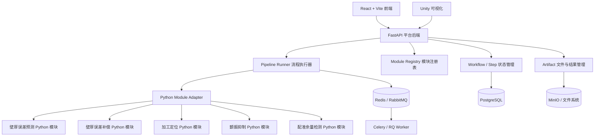
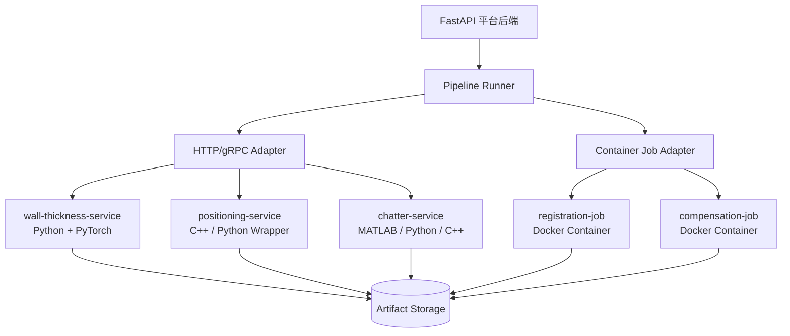
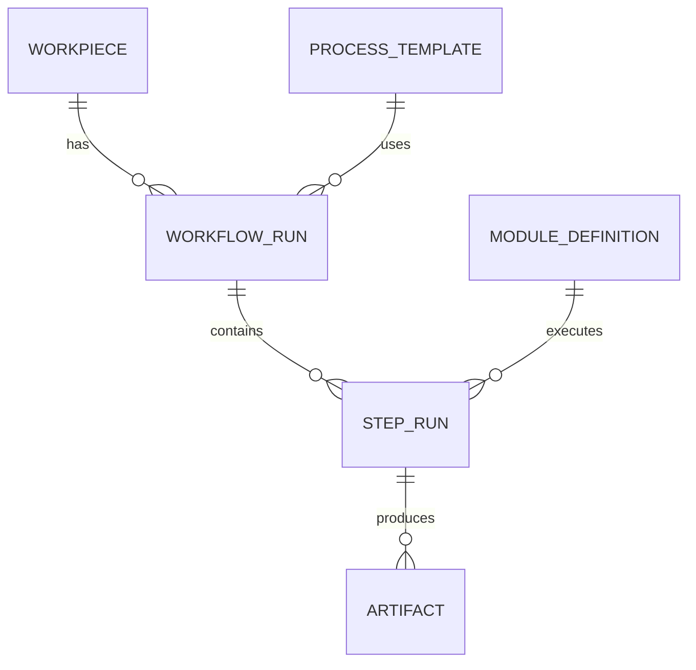

# 开发技术文档

**项目定位**：面向多阶段加工工艺验证与优化的数字孪生平台  
**当前技术栈**：FastAPI + Pydantic 后端，React + Vite 前端，Unity 可视化  
**短期目标**：算法模块均为 Python，实现统一 Python 模块接口与固定工艺 Pipeline Runner  
**长期目标**：算法模块逐步 Docker 化，支持不同语言、不同依赖、不同运行环境的模块接入  
**文档版本**：v0.1  
**更新时间**：2026-05-09

---

## 1. 背景与核心结论

当前系统已经具备虚拟调试、真实数据接入、Unity 可视化和壁厚误差预测补偿等能力。后续还会增加加工定位、加工过程监控、颤振抑制、加工后配准余量检测等模块。

这些模块属于同一条相对固定的加工工艺链：

```text
加工前定位
→ 壁厚误差预测
→ 加工过程监控
→ 颤振抑制
→ 加工后配准余量检测
→ 壁厚误差补偿
```

用户通常不需要自由拖拽任意复杂流程，只需要：

1. 选择本次工艺流程中哪些阶段执行、哪些跳过；
2. 配置每个阶段的少量关键参数；
3. 查看整体流程运行状态；
4. 必要时进入某个模块详情页查看输入、输出、日志、指标和可视化结果。

因此，短期不建议直接上完整 BPMN 工作流引擎或复杂微服务平台。推荐采用：

> **固定工艺 Pipeline Runner + 模块注册表 + Python 模块适配器 + 异步任务执行 + Artifact 结果管理。**

长期当算法依赖复杂、不同语言混用、模块需要独立部署时，再演进为：

> **FastAPI 平台后端 + Docker 化算法模块 + HTTP/gRPC 模块接口 + 容器任务编排。**

---

## 2. 总体架构

### 2.1 逻辑架构



### 2.2 短期部署形态

短期所有算法都是 Python，可以采用“模块化单体 + Worker”的方式：

```text
frontend/       React + Vite
backend/        FastAPI 平台后端
workers/        Celery/RQ Worker，运行 Python 算法模块
unity/          Unity 可视化客户端或 WebGL
storage/        文件系统或 MinIO
database/       PostgreSQL
queue/          Redis 或 RabbitMQ
```

短期重点不是把每个算法都拆成服务，而是统一模块接口、统一输入输出、统一运行记录。

### 2.3 长期部署形态

长期当模块依赖差异变大时，逐步改为 Docker 化模块：



---

## 3. 架构原则

### 3.1 平台管流程，模块管算法

FastAPI 平台后端负责：

- 工件管理；
- 流程配置；
- 模块注册；
- 运行状态；
- 任务调度；
- 参数校验；
- 结果记录；
- 权限、日志、审计；
- 向 React 和 Unity 提供统一 API。

算法模块负责：

- 读取本模块输入；
- 执行算法；
- 输出指标、文件、可视化数据；
- 不直接控制整体流程。

### 3.2 Unity 只做可视化，不做流程调度

Unity 不应该直接调用各个算法模块。推荐关系是：

```text
React 配置流程
→ FastAPI 创建流程运行
→ Worker/模块执行算法
→ FastAPI 记录结果
→ Unity 读取可视化 Artifact 并展示
```

Unity 需要的只是：

- 工件几何；
- 误差场；
- 点云；
- 余量分布；
- 风险区域；
- 刀路或补偿结果；
- 流程状态事件。

### 3.3 大数据走 Artifact，小数据走 JSON

接口中不要直接传输大文件或大数组。推荐：

- 小数据：JSON；
- 结构化接口：Pydantic Model；
- 大文件：Artifact；
- 点云、网格、误差场、刀路、报告：文件存储；
- 接口中只返回 `artifact_id`、`artifact_type`、`uri`、`metadata`。

### 3.4 短期 Python，长期 Docker，但接口设计要提前兼容

即使短期全部 Python，也不要在 Pipeline Runner 中直接写死：

```python
result = wall_thickness_predict(...)
```

而应写成：

```python
adapter = module_registry.get(stage)
result = adapter.run(context, params)
```

这样长期把模块迁移到 Docker 服务时，只需要替换 Adapter，不需要重写主流程。

---

## 4. 工艺阶段定义

### 4.1 固定阶段枚举

```python
from enum import Enum

class ProcessStage(str, Enum):
    PRE_POSITIONING = "pre_positioning"
    WALL_THICKNESS_PREDICTION = "wall_thickness_prediction"
    MACHINING_MONITORING = "machining_monitoring"
    CHATTER_SUPPRESSION = "chatter_suppression"
    POST_REGISTRATION_MARGIN_DETECTION = "post_registration_margin_detection"
    WALL_THICKNESS_COMPENSATION = "wall_thickness_compensation"
```

### 4.2 固定执行顺序

```python
STAGE_ORDER = [
    ProcessStage.PRE_POSITIONING,
    ProcessStage.WALL_THICKNESS_PREDICTION,
    ProcessStage.MACHINING_MONITORING,
    ProcessStage.CHATTER_SUPPRESSION,
    ProcessStage.POST_REGISTRATION_MARGIN_DETECTION,
    ProcessStage.WALL_THICKNESS_COMPENSATION,
]
```

### 4.3 阶段说明

| 阶段 | 英文标识 | 说明 | 短期实现方式 | 长期实现方式 |
|---|---|---|---|---|
| 加工前定位 | `pre_positioning` | 根据工件、夹具、坐标系和测量数据完成定位 | Python Adapter | Docker/HTTP 服务 |
| 壁厚误差预测 | `wall_thickness_prediction` | 预测壁厚误差场和风险区域 | Python Adapter | Docker + GPU 服务 |
| 加工过程监控 | `machining_monitoring` | 接收过程数据并监控状态 | Python 服务 | 流式服务 + MQTT/Kafka |
| 颤振抑制 | `chatter_suppression` | 检测颤振风险并生成抑制策略 | Python Adapter | 独立实时服务 |
| 加工后配准余量检测 | `post_registration_margin_detection` | 加工后点云/模型配准并检测余量 | Python Adapter | Docker 批处理容器 |
| 壁厚误差补偿 | `wall_thickness_compensation` | 基于误差预测或检测结果生成补偿方案 | Python Adapter | Docker/HTTP 服务 |

---

## 5. 数据模型设计

### 5.1 核心实体



### 5.2 Workpiece 工件

```text
workpiece
- id
- name
- material
- geometry_artifact_id
- process_plan_id
- current_state_json
- created_at
- updated_at
```

`current_state_json` 用于记录当前孪生状态，例如定位结果、壁厚状态、风险区域、补偿状态等。

### 5.3 ModuleDefinition 模块定义

```text
module_definition
- id
- module_id
- name
- stage
- version
- description
- runtime_type
- entrypoint
- input_schema_json
- output_schema_json
- default_params_json
- enabled
- created_at
- updated_at
```

`runtime_type` 短期可取：

```text
python_adapter
```

长期可扩展为：

```text
python_adapter
http_service
grpc_service
docker_container
kubernetes_job
```

### 5.4 ProcessTemplate 流程模板

```text
process_template
- id
- name
- version
- stage_order_json
- default_enabled_stages_json
- created_at
- updated_at
```

当前阶段只需要一个默认模板即可。

### 5.5 WorkflowRun 流程运行实例

```text
workflow_run
- id
- workpiece_id
- template_id
- status
- config_json
- created_by
- created_at
- started_at
- finished_at
- error_message
```

`status` 可取：

```text
pending
running
succeeded
failed
cancelled
```

### 5.6 StepRun 阶段运行实例

```text
step_run
- id
- workflow_run_id
- stage
- module_id
- module_version
- status
- input_json
- params_json
- output_json
- metrics_json
- error_message
- retry_count
- started_at
- finished_at
```

`status` 可取：

```text
pending
queued
running
skipped
succeeded
failed
cancelled
```

### 5.7 Artifact 文件与结果

```text
artifact
- id
- workflow_run_id
- step_run_id
- artifact_type
- uri
- filename
- content_type
- size_bytes
- metadata_json
- created_at
```

常见 `artifact_type`：

```text
geometry
mesh
pointcloud
measurement_data
error_field
risk_region
toolpath
compensation_result
registration_result
report
log
preview_image
unity_visualization_payload
```

---

## 6. 流程配置格式

用户创建一次流程运行时，前端提交：

```json
{
  "workpiece_id": "W20260509-001",
  "template_id": "default_machining_pipeline",
  "enabled_stages": {
    "pre_positioning": true,
    "wall_thickness_prediction": true,
    "machining_monitoring": false,
    "chatter_suppression": false,
    "post_registration_margin_detection": true,
    "wall_thickness_compensation": true
  },
  "stage_params": {
    "pre_positioning": {
      "coordinate_system": "fixture_cs_01"
    },
    "wall_thickness_prediction": {
      "model_version": "v1.0.0",
      "mesh_resolution": "medium"
    },
    "post_registration_margin_detection": {
      "registration_method": "icp"
    },
    "wall_thickness_compensation": {
      "strategy": "toolpath_offset",
      "max_compensation_mm": 0.3
    }
  }
}
```

后端需要保存完整 `config_json`，保证运行可追溯。

---

## 7. Python 模块接口设计

短期所有算法都是 Python，推荐统一 `ModuleAdapter` 接口。

### 7.1 基础接口

```python
from abc import ABC, abstractmethod
from typing import Any, Dict

class ModuleAdapter(ABC):
    module_id: str
    stage: str
    version: str

    @abstractmethod
    def metadata(self) -> Dict[str, Any]:
        pass

    @abstractmethod
    def validate_input(self, context: Dict[str, Any], params: Dict[str, Any]) -> None:
        pass

    @abstractmethod
    def run(self, context: Dict[str, Any], params: Dict[str, Any]) -> Dict[str, Any]:
        pass

    def summarize_result(self, result: Dict[str, Any]) -> Dict[str, Any]:
        return {
            "metrics": result.get("metrics", {}),
            "artifacts": result.get("artifacts", []),
            "visualization": result.get("visualization", {})
        }
```

### 7.2 上下文 Context

`context` 由平台后端构造，包含当前工件、前序步骤结果、相关文件和当前孪生状态。

```json
{
  "workflow_run_id": "run_001",
  "step_run_id": "step_002",
  "workpiece": {
    "id": "W20260509-001",
    "material": "Ti-6Al-4V",
    "geometry_artifact_id": "artifact_geometry_001"
  },
  "twin_state": {
    "coordinate_system": "fixture_cs_01",
    "previous_error_field_artifact_id": null
  },
  "previous_steps": {
    "pre_positioning": {
      "status": "succeeded",
      "output": {
        "coordinate_transform_artifact_id": "artifact_transform_001"
      }
    }
  },
  "artifacts": {
    "geometry": {
      "artifact_id": "artifact_geometry_001",
      "uri": "s3://bucket/workpieces/W20260509-001/geometry.step"
    }
  }
}
```

### 7.3 模块输出标准

每个模块统一返回：

```json
{
  "status": "succeeded",
  "metrics": {
    "max_error_mm": 0.42,
    "mean_error_mm": 0.11
  },
  "output": {
    "risk_level": "medium"
  },
  "artifacts": [
    {
      "type": "error_field",
      "uri": "s3://bucket/runs/run_001/wall_prediction/error_field.vtk",
      "metadata": {
        "unit": "mm",
        "format": "vtk"
      }
    }
  ],
  "visualization": {
    "unity_view_type": "error_heatmap",
    "primary_artifact_type": "error_field"
  },
  "logs": [
    "loaded geometry",
    "finished prediction"
  ]
}
```

---

## 8. Pydantic Schema 示例

### 8.1 流程创建请求

```python
from pydantic import BaseModel, Field
from typing import Dict, Any, Optional

class CreateWorkflowRunRequest(BaseModel):
    workpiece_id: str
    template_id: str = "default_machining_pipeline"
    enabled_stages: Dict[str, bool]
    stage_params: Dict[str, Dict[str, Any]] = Field(default_factory=dict)
```

### 8.2 流程状态响应

```python
class StepRunSummary(BaseModel):
    id: str
    stage: str
    module_id: str | None = None
    status: str
    progress: float | None = None
    started_at: str | None = None
    finished_at: str | None = None
    error_message: str | None = None

class WorkflowRunResponse(BaseModel):
    id: str
    workpiece_id: str
    status: str
    steps: list[StepRunSummary]
```

### 8.3 Artifact 响应

```python
class ArtifactResponse(BaseModel):
    id: str
    artifact_type: str
    uri: str
    filename: str | None = None
    content_type: str | None = None
    metadata: dict = Field(default_factory=dict)
```

---

## 9. 模块注册表设计

### 9.1 Python 内存注册方式

短期可以先用代码注册：

```python
MODULE_REGISTRY = {
    "pre_positioning": PrePositioningAdapter(),
    "wall_thickness_prediction": WallThicknessPredictionAdapter(),
    "post_registration_margin_detection": RegistrationMarginDetectionAdapter(),
    "wall_thickness_compensation": WallThicknessCompensationAdapter(),
}
```

### 9.2 配置文件注册方式

进一步可以迁移为 `module_manifest.yaml`：

```yaml
module_id: wall_thickness_prediction
name: 壁厚误差预测
stage: wall_thickness_prediction
version: 1.0.0

runtime:
  type: python_adapter
  adapter_class: app.modules.wall_thickness_prediction.adapter.WallThicknessPredictionAdapter

input_schema: app.modules.wall_thickness_prediction.schema.WallPredictionInput
output_schema: app.modules.wall_thickness_prediction.schema.WallPredictionOutput

execution:
  async: true
  timeout_seconds: 1800
  retry: 1

artifacts:
  input:
    - geometry
    - process_parameters
    - measurement_data
  output:
    - error_field
    - prediction_report
    - risk_regions
```

### 9.3 数据库注册方式

长期推荐把模块注册信息落库，前端通过接口读取模块列表。

---

## 10. Pipeline Runner 设计

### 10.1 执行逻辑

```python
def run_workflow(workflow_run_id: str):
    workflow_run = load_workflow_run(workflow_run_id)
    config = workflow_run.config_json

    mark_workflow_running(workflow_run_id)

    for stage in STAGE_ORDER:
        enabled = config["enabled_stages"].get(stage.value, False)

        step = create_step_run(
            workflow_run_id=workflow_run_id,
            stage=stage.value,
            status="pending"
        )

        if not enabled:
            mark_step_skipped(step.id)
            continue

        adapter = module_registry.get(stage.value)
        if adapter is None:
            mark_step_failed(step.id, f"No module registered for stage: {stage.value}")
            mark_workflow_failed(workflow_run_id)
            return

        try:
            context = build_context(workflow_run_id, step.id, stage.value)
            params = config.get("stage_params", {}).get(stage.value, {})

            adapter.validate_input(context, params)

            mark_step_running(step.id)
            result = adapter.run(context, params)

            save_step_result(step.id, result)
            save_artifacts(workflow_run_id, step.id, result.get("artifacts", []))
            update_twin_state(workflow_run.workpiece_id, stage.value, result)

            mark_step_succeeded(step.id)

        except Exception as exc:
            mark_step_failed(step.id, str(exc))
            mark_workflow_failed(workflow_run_id)
            return

    mark_workflow_succeeded(workflow_run_id)
```

### 10.2 同步与异步

短期建议：

- 流程创建接口只负责创建 `workflow_run`；
- 真正执行交给 Celery/RQ；
- 前端通过轮询或 WebSocket 查询状态。

```text
POST /api/workflow-runs
→ 创建 workflow_run
→ 提交 Celery/RQ 任务
→ 立即返回 run_id
```

---

## 11. 平台 API 定义

### 11.1 模块相关 API

```http
GET /api/modules
```

返回所有已注册模块。

```json
[
  {
    "module_id": "wall_thickness_prediction",
    "name": "壁厚误差预测",
    "stage": "wall_thickness_prediction",
    "version": "1.0.0",
    "runtime_type": "python_adapter",
    "description": "根据工件几何、工艺参数和测量数据预测壁厚误差场",
    "enabled": true
  }
]
```

```http
GET /api/modules/{module_id}
```

返回模块详情，包括输入输出 schema、默认参数、支持的 artifact 类型。

### 11.2 流程模板 API

```http
GET /api/process-templates/default
```

返回默认流程模板：

```json
{
  "template_id": "default_machining_pipeline",
  "name": "默认加工工艺流程",
  "stage_order": [
    "pre_positioning",
    "wall_thickness_prediction",
    "machining_monitoring",
    "chatter_suppression",
    "post_registration_margin_detection",
    "wall_thickness_compensation"
  ],
  "default_enabled_stages": {
    "pre_positioning": true,
    "wall_thickness_prediction": true,
    "machining_monitoring": false,
    "chatter_suppression": false,
    "post_registration_margin_detection": true,
    "wall_thickness_compensation": true
  }
}
```

### 11.3 流程运行 API

```http
POST /api/workflow-runs
```

创建流程运行。

```http
GET /api/workflow-runs/{run_id}
```

查询整体状态。

```http
GET /api/workflow-runs/{run_id}/steps
```

查询所有阶段状态。

```http
GET /api/workflow-runs/{run_id}/steps/{step_id}
```

查询某个阶段详情，包括输入、输出、指标、日志、artifact。

```http
POST /api/workflow-runs/{run_id}/cancel
```

取消流程运行。

```http
POST /api/workflow-runs/{run_id}/retry
```

重试失败流程或失败阶段。短期可以只支持从失败阶段开始重试。

### 11.4 Artifact API

```http
GET /api/artifacts/{artifact_id}
```

返回 artifact 元信息。

```http
GET /api/artifacts/{artifact_id}/download
```

下载 artifact 文件。

```http
GET /api/artifacts/{artifact_id}/preview
```

返回可预览内容，例如图片、简化网格、点云缩略数据。

### 11.5 Unity 可视化 API

```http
GET /api/workpieces/{workpiece_id}/geometry
```

获取工件几何 artifact。

```http
GET /api/workflow-runs/{run_id}/visualization-state
```

返回当前运行可视化状态：

```json
{
  "workpiece_id": "W20260509-001",
  "active_stage": "wall_thickness_prediction",
  "available_views": [
    {
      "view_type": "error_heatmap",
      "artifact_id": "artifact_error_field_001"
    },
    {
      "view_type": "risk_regions",
      "artifact_id": "artifact_risk_regions_001"
    }
  ]
}
```

### 11.6 WebSocket 事件接口

```http
WS /api/workflow-runs/{run_id}/events
```

事件格式：

```json
{
  "event_type": "step_status_changed",
  "workflow_run_id": "run_001",
  "step_run_id": "step_002",
  "stage": "wall_thickness_prediction",
  "status": "running",
  "progress": 0.35,
  "message": "正在计算壁厚误差场"
}
```

---

## 12. 任务队列设计

### 12.1 为什么需要任务队列

算法模块可能耗时较长，不应让 HTTP 请求长时间阻塞。流程创建后，应立即返回 `workflow_run_id`，后台任务负责执行流程。

### 12.2 推荐技术

短期：

```text
Redis + RQ
```

适合较轻量原型。

稍复杂后：

```text
Redis/RabbitMQ + Celery
```

适合重试、定时、多个 worker、任务路由和运行监控。

### 12.3 Worker 划分

可以按资源类型划分 worker：

```text
default-worker
geometry-worker
prediction-worker
registration-worker
monitoring-worker
gpu-worker
```

短期也可以只使用一个 worker。

---

## 13. 错误处理与重试

### 13.1 错误类型

```text
ValidationError       输入参数错误
MissingArtifactError  缺少必要文件
ModuleRuntimeError    算法执行失败
TimeoutError          模块运行超时
CancelledError        用户取消
SystemError           系统异常
```

### 13.2 失败策略

短期建议：

- 某个启用阶段失败后，整体流程标记为 failed；
- 前序成功结果保留；
- 用户可以查看失败详情；
- 用户可以修改参数后重试；
- 重试时优先支持“从失败阶段重试”。

### 13.3 重试记录

每次重试需要保留历史，不应覆盖原始失败记录。推荐：

```text
step_run.retry_count
step_run.parent_step_run_id
```

或者创建新的 `step_run` 并关联原始失败 step。

---

## 14. Artifact 管理细节

### 14.1 存储路径规范

```text
/artifacts
  /workpieces/{workpiece_id}
    /geometry
    /measurement
  /runs/{workflow_run_id}
    /{stage}
      /input
      /output
      /logs
      /preview
```

示例：

```text
s3://dt-platform/runs/run_001/wall_thickness_prediction/output/error_field.vtk
s3://dt-platform/runs/run_001/wall_thickness_prediction/output/report.pdf
s3://dt-platform/runs/run_001/post_registration_margin_detection/output/aligned_pointcloud.ply
```

### 14.2 Artifact 元信息

```json
{
  "artifact_type": "error_field",
  "uri": "s3://dt-platform/runs/run_001/wall_thickness_prediction/output/error_field.vtk",
  "content_type": "model/vnd.vtk",
  "metadata": {
    "unit": "mm",
    "coordinate_system": "fixture_cs_01",
    "min_error_mm": -0.18,
    "max_error_mm": 0.42
  }
}
```

---

## 15. 前端页面设计

### 15.1 工艺流程配置页

页面结构：

```text
工件信息
流程阶段列表
  [✓] 加工前定位             参数配置 / 查看说明
  [✓] 壁厚误差预测           参数配置 / 查看说明
  [ ] 加工过程监控           参数配置 / 查看说明
  [ ] 颤振抑制               参数配置 / 查看说明
  [✓] 加工后配准余量检测     参数配置 / 查看说明
  [✓] 壁厚误差补偿           参数配置 / 查看说明

开始运行
```

### 15.2 流程运行状态页

```text
整体状态：running / succeeded / failed

阶段时间线：
1. 加工前定位                 succeeded
2. 壁厚误差预测               running  35%
3. 加工过程监控               skipped
4. 颤振抑制                   skipped
5. 加工后配准余量检测         pending
6. 壁厚误差补偿               pending
```

### 15.3 模块详情页

模块详情页展示：

- 模块名称；
- 模块版本；
- 所属阶段；
- 输入参数；
- 输入 artifact；
- 输出指标；
- 输出 artifact；
- 日志；
- 错误信息；
- Unity 可视化入口。

---

## 16. Unity 集成细节

### 16.1 Unity 读取内容

Unity 不直接执行算法，只读取：

```text
工件几何
点云
误差场
余量分布
风险区域
补偿结果
刀路
当前流程状态
```

### 16.2 Unity 数据接口

Unity 可通过 HTTP 拉取当前视图所需 artifact，通过 WebSocket 接收状态变化。

推荐接口：

```text
GET /api/workflow-runs/{run_id}/visualization-state
GET /api/artifacts/{artifact_id}
GET /api/artifacts/{artifact_id}/download
WS  /api/workflow-runs/{run_id}/events
```

### 16.3 Unity 渲染类型

```text
geometry_view
error_heatmap
risk_region_overlay
pointcloud_registration
margin_distribution
toolpath_preview
compensation_result
```

模块输出中应包含：

```json
{
  "visualization": {
    "unity_view_type": "error_heatmap",
    "primary_artifact_type": "error_field",
    "coordinate_system": "fixture_cs_01"
  }
}
```

---

## 17. 长期 Docker 化设计

### 17.1 为什么长期需要 Docker

当不同模块使用不同语言、库、系统依赖或 GPU 运行环境时，把它们放进同一个 Python 环境会导致依赖冲突。Docker 可以把模块代码、运行时、系统库和依赖打包成独立镜像，使模块运行环境隔离。

### 17.2 Docker 化模块接口

长期每个模块可以暴露统一 HTTP 接口：

```http
GET /metadata
POST /validate
POST /run
GET /jobs/{job_id}
GET /jobs/{job_id}/result
POST /jobs/{job_id}/cancel
GET /health
```

### 17.3 Docker 模块 Manifest

```yaml
module_id: wall_thickness_prediction
name: 壁厚误差预测
stage: wall_thickness_prediction
version: 2.0.0

runtime:
  type: http_service
  image: registry.example.com/dt/wall-thickness-prediction:2.0.0
  endpoint: http://wall-thickness-prediction:8001

resources:
  cpu: "4"
  memory: "8Gi"
  gpu: false

execution:
  async: true
  timeout_seconds: 3600
  retry: 1

input_schema: schemas/input.schema.json
output_schema: schemas/output.schema.json
```

### 17.4 HTTP Adapter 示例

```python
import httpx

class HttpModuleAdapter(ModuleAdapter):
    def __init__(self, module_id: str, endpoint: str):
        self.module_id = module_id
        self.endpoint = endpoint

    async def validate_input(self, context, params):
        async with httpx.AsyncClient(timeout=60) as client:
            response = await client.post(
                f"{self.endpoint}/validate",
                json={"context": context, "params": params}
            )
            response.raise_for_status()

    async def run(self, context, params):
        async with httpx.AsyncClient(timeout=None) as client:
            response = await client.post(
                f"{self.endpoint}/run",
                json={"context": context, "params": params}
            )
            response.raise_for_status()
            return response.json()
```

### 17.5 容器任务模式

对于非常驻服务类模块，例如大型配准、刀路补偿、离线仿真，可以采用容器任务模式：

```text
FastAPI 创建 step_run
→ 生成输入 artifact
→ 启动容器任务
→ 容器读取输入文件
→ 容器执行算法
→ 容器写出输出文件
→ 平台保存 artifact 和状态
```

未来如果使用 Kubernetes，可进一步接入 Argo Workflows 或 Kubernetes Job。

---

## 18. 是否需要 Temporal / Argo / Camunda

### 18.1 当前阶段不建议直接使用

当前流程固定，用户只是配置阶段是否执行，不需要复杂分支、审批、人工流转、自由拖拽和跨系统长流程。因此暂时不需要 Camunda/BPMN。

### 18.2 何时考虑 Temporal

当出现以下情况时，可以考虑 Temporal：

- 一个流程运行数小时甚至数天；
- 服务重启后流程必须自动恢复；
- 有复杂重试、补偿、等待、取消逻辑；
- 多个模块跨服务调用，状态管理变复杂。

### 18.3 何时考虑 Argo Workflows

当出现以下情况时，可以考虑 Argo Workflows：

- 每个模块都是 Docker 镜像；
- 已经使用 Kubernetes；
- 希望按容器 step 编排任务；
- 需要并行任务、资源限制和容器级日志。

### 18.4 当前推荐

```text
短期：FastAPI + Python Adapter + Celery/RQ
中期：FastAPI + Dockerized Module Service
长期：Temporal 或 Argo Workflows
```

---

## 19. 推荐项目目录结构

```text
project-root/
  frontend/
    src/
      pages/
      components/
      api/
  backend/
    app/
      main.py
      api/
        modules.py
        workflow_runs.py
        artifacts.py
        workpieces.py
      core/
        config.py
        logging.py
      db/
        models.py
        session.py
      schemas/
        workflow.py
        module.py
        artifact.py
      services/
        pipeline_runner.py
        module_registry.py
        artifact_service.py
        twin_state_service.py
      modules/
        base.py
        pre_positioning/
          adapter.py
          schema.py
          manifest.yaml
        wall_thickness_prediction/
          adapter.py
          schema.py
          manifest.yaml
        wall_thickness_compensation/
          adapter.py
          schema.py
          manifest.yaml
      workers/
        celery_app.py
        tasks.py
  unity/
    Assets/
  docker/
    docker-compose.yml
  docs/
    开发技术文档.md
```

---

## 20. 开发里程碑

### 20.1 第一阶段：跑通固定流程

目标：

- 定义固定 `STAGE_ORDER`；
- 实现 `workflow_run` 和 `step_run`；
- 实现模块注册表；
- 接入壁厚误差预测和补偿两个模块；
- React 能配置启用/禁用；
- Unity 能展示一个输出 artifact。

完成标准：

```text
用户选择工件
→ 勾选壁厚误差预测和补偿
→ 点击开始运行
→ 后台按顺序执行
→ 前端显示状态
→ Unity 显示误差场或补偿结果
```

### 20.2 第二阶段：补齐完整工艺链

新增：

- 加工前定位；
- 加工过程监控；
- 颤振抑制；
- 加工后配准余量检测；
- 更完整的 artifact 类型；
- 模块详情页。

### 20.3 第三阶段：异步任务与运行稳定性

新增：

- Celery/RQ；
- 任务取消；
- 失败重试；
- 日志查看；
- WebSocket 状态推送；
- 运行历史查询。

### 20.4 第四阶段：Docker 化模块

新增：

- 每个复杂模块独立 Dockerfile；
- 模块 HTTP 接口；
- HTTP Adapter；
- Docker Compose 本地部署；
- 模块健康检查；
- 资源隔离。

### 20.5 第五阶段：高级编排

按需要选择：

- Temporal：长流程可靠执行；
- Argo Workflows：Kubernetes 容器任务编排；
- MQTT/Kafka：实时过程数据流；
- 时序数据库：加工过程监控数据存储。

---

## 21. 关键开发注意事项

### 21.1 不要让前端或 Unity 拼接业务流程

流程顺序、阶段依赖、失败策略必须在后端统一管理。前端只提交配置。

### 21.2 不要让模块直接修改全局状态

模块只返回结果，平台后端决定如何更新 `twin_state`。

### 21.3 不要把大文件塞进 JSON

点云、网格、误差场、报告、刀路都应保存为 artifact。

### 21.4 每次运行必须可追溯

必须保存：

- 输入参数；
- 输入 artifact；
- 模块版本；
- 输出 artifact；
- 指标；
- 日志；
- 错误；
- 开始和结束时间。

### 21.5 模块版本必须记录

同一个模块不同版本可能产生不同结果。`step_run` 中必须记录实际运行的 `module_version`。

### 21.6 短期也要为 Docker 留接口

即使现在全部 Python，也要使用 Adapter 调用，不要把算法函数散落在流程代码里。

---

## 22. 技术选型表

| 问题 | 短期选择 | 长期选择 |
|---|---|---|
| 平台 API | FastAPI | FastAPI / API Gateway |
| 数据校验 | Pydantic | Pydantic + OpenAPI/JSON Schema |
| 前端 | React + Vite | React + Vite |
| 可视化 | Unity | Unity / WebGL / 独立客户端 |
| 流程控制 | 自研固定 Pipeline Runner | Temporal / Argo Workflows |
| 异步任务 | RQ 或 Celery | Celery / Temporal / Argo |
| 模块接入 | Python Adapter | HTTP/gRPC Adapter / Container Job |
| 文件结果 | 本地文件系统 | MinIO / S3 |
| 关系数据 | PostgreSQL | PostgreSQL |
| 队列 | Redis | Redis / RabbitMQ |
| 部署 | 单机或 Docker Compose | Docker Compose / Kubernetes |
| 实时过程数据 | 暂缓或 WebSocket | MQTT / Kafka / 时序数据库 |

---

## 23. 参考资料

以下资料用于确认技术方向和术语边界：

1. FastAPI 官方文档：FastAPI 是基于 Python 类型提示构建 API 的 Web 框架，并提供 OpenAPI 文档能力。  
   https://fastapi.tiangolo.com/

2. Pydantic JSON Schema 文档：Pydantic 可以根据模型生成 JSON Schema，适合定义模块输入输出契约。  
   https://pydantic.dev/docs/validation/latest/concepts/json_schema/

3. Celery 官方文档：Celery 是分布式任务队列，适合处理实时任务和调度任务。  
   https://docs.celeryq.dev/

4. Docker 容器说明：容器用于把代码及依赖打包，使应用能在不同环境中可靠运行。  
   https://www.docker.com/resources/what-container/

5. Docker 开发文档：介绍容器化应用、多容器应用和 Docker Compose 等开发方式。  
   https://docs.docker.com/get-started/introduction/develop-with-containers/

---

## 24. 当前建议结论

当前最合适的实现方式是：

```text
FastAPI 平台后端
+ Pydantic 数据契约
+ 固定工艺 Pipeline Runner
+ Module Registry
+ Python Module Adapter
+ PostgreSQL 记录 workflow_run / step_run / artifact
+ Redis + Celery/RQ 执行耗时任务
+ React 配置和查看
+ Unity 读取 artifact 并可视化
```

长期演进时：

```text
Python Adapter
→ HTTP/gRPC Adapter
→ Dockerized Module Service
→ Container Job / Kubernetes Job
→ Temporal 或 Argo Workflows
```

核心原则是：

> **主平台稳定，算法模块可替换；流程固定但可配置；短期 Python 接入，长期 Docker 隔离。**
